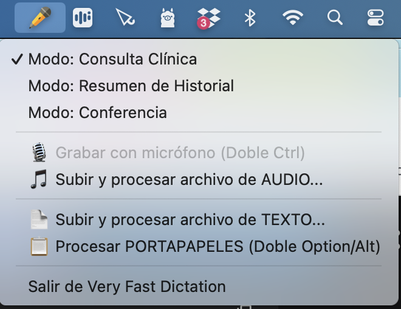

# VERSION MAC de Very Fast Dictation - Medical Edition 🩺⚡️

Una herramienta de transcripción y estructuración clínica ultrarrápida impulsada por Inteligencia Artificial local, diseñada específicamente para entornos médicos y optimizada para macOS (Apple Silicon). 

Permite a los profesionales de la salud dictar consultas en tiempo real, resumir historiales médicos caóticos o transcribir largas conferencias magistrales, transformando el texto en bruto en informes académicos perfectamente estructurados. Todo el procesamiento se realiza **100% en local**, garantizando la privacidad absoluta del paciente.

---

## ✨ Características Principales

* 🎙️ **Transcripción de Alta Precisión:** Utiliza *Whisper Turbo* combinado con un filtro anti-ruido (*Silero VAD*) para capturar la voz humana aislando el ruido de fondo de la consulta.
* 🧠 **Estructuración Inteligente (LLM Local):** Integración directa con **Ollama** para usar modelos de vanguardia (`DeepSeek-R1:14b` y `Qwen2.5`), extrayendo el contexto médico sin alucinaciones ni redundancias.
* 👻 **Interfaz "Ventana Fantasma":** Una UI translúcida, flotante y minimalista que no roba el foco del ratón. Inmune a las transiciones del Finder de macOS, muestra el progreso de la IA en tiempo real al estilo terminal *cyberpunk*.
* ⏱️ **Cronómetros Dinámicos Nativos:** Seguimiento exacto del tiempo de transcripción y razonamiento de la IA con animaciones nativas sin consumo extra de RAM.
* ⚡ **Disparadores por Atajos:** Integración profunda con macOS. Inicia grabaciones o procesa el portapapeles en un instante mediante atajos de teclado invisibles.

---

## ⚙️ Modos de Funcionamiento

La aplicación opera desde la barra de menú superior de tu Mac (System Tray) y ofrece tres modos especializados:

1.  **Consulta Clínica (`qwen2.5`):** Analiza un diálogo continuo sin etiquetas, separa semánticamente al doctor del paciente, traduce metáforas coloquiales a terminología médica (mediante un glosario personalizable) y genera un informe SOAP completo.
2.  **Resumen de Historial (`deepseek-r1:14b`):** Toma un volcado de notas caóticas, siglas y pruebas de laboratorio, lo ordena cronológicamente y redacta un plan terapéutico con justificación biológica basada puramente en la evidencia del texto.
3.  **Conferencia Médica (`deepseek-r1:14b`):** Procesa ponencias de gran longitud. Incluye un **Troceador Inteligente** que fragmenta audios masivos (más de 6.000 palabras), extrae los conceptos fisiopatológicos, elimina la "paja" y el *Spanglish*, y unifica todo en un resumen académico brillante sin redundancias.

---
¡Me parece una idea brillante! La sección de requisitos previos actual es perfecta para un programador, pero si otro médico o un usuario menos técnico quiere instalar tu aplicación, se va a encontrar con un muro.

Desglosar esta parte en una **"Guía de Instalación Paso a Paso"** a prueba de fallos es lo que convierte un buen proyecto en un software profesional de primer nivel.

Aquí tienes la versión ampliada y detallada. Puedes sustituir la sección actual de tu `README.md` por esta, o crear un archivo anexo llamado `INSTALACION.md` si prefieres mantener el README más corto.

---

## 🛠️ Requisitos Previos (Guía Detallada)

Para que **Very Fast Dictation** funcione a la velocidad del rayo y proteja la privacidad del paciente procesando todo de forma 100% local, tu Mac necesita preparar el terreno. Sigue estos 4 pasos:

### Paso 1: Verificación del Sistema (macOS)

El procesamiento de Inteligencia Artificial local requiere mucha potencia gráfica y memoria.

1. Haz clic en el logo de Apple () en la esquina superior izquierda de tu pantalla y selecciona **"Acerca de este Mac"**.
2. Comprueba que el **Chip** sea de la familia Apple Silicon (**M1, M2, M3 o M4** en cualquiera de sus variantes: Pro, Max, Ultra).
3. *Nota:* La aplicación funcionará en Macs antiguos con procesador Intel, pero los tiempos de redacción de la IA serán significativamente más lentos.

### Paso 2: Instalar `uv` (El gestor de Python)

Nuestra aplicación está escrita en Python, pero en lugar de complicarnos con instalaciones manuales, utilizamos **`uv`**, un gestor ultrarrápido que se encarga de descargar la versión correcta de Python y todas las librerías automáticamente.

1. Abre la aplicación **Terminal** en tu Mac (puedes buscarla con `Cmd + Espacio`).
2. Copia este comando, pégalo en la Terminal y pulsa Enter:
```bash
curl -LsSf https://astral.sh/uv/install.sh | sh

```


3. Cierra la ventana de la Terminal y vuelve a abrir una nueva para que los cambios surtan efecto.

### Paso 3: Instalar Ollama (El motor de la IA)

Ollama es la aplicación invisible que permite a tu Mac ejecutar modelos de lenguaje gigantescos como si fueran programas normales.

1. Entra en [https://ollama.com/](https://ollama.com/) y haz clic en el botón **"Download"** para macOS.
2. Descomprime el archivo descargado y arrastra la aplicación **Ollama** a tu carpeta de *Aplicaciones*.
3. Abre la aplicación Ollama. Te pedirá permiso para instalarse. Una vez hecho, verás el icono de una pequeña llama blanca en la barra superior derecha de tu Mac. Eso significa que el motor ya está encendido en segundo plano.

### Paso 4: Descargar los Modelos Médicos (LLMs)

Ahora que el motor (Ollama) está encendido, necesitamos descargarle los "cerebros" que hemos elegido para nuestra aplicación. **Atención:** Estos archivos son pesados (entre 4 y 9 GB cada uno), por lo que este paso dependerá de tu conexión a internet.

1. Abre la **Terminal**.
2. Descarga el modelo para el **Modo Consulta** (rápido e inteligente) pegando este comando y pulsando Enter:
```bash
ollama run qwen2.5

```


*(Verás una barra de progreso. Cuando termine, aparecerá un cursor para chatear. Escribe `/bye` y pulsa Enter para salir).*
3. Descarga el modelo para el **Modo Historial y Conferencia** (alta capacidad de razonamiento clínico) pegando este comando y pulsando Enter:
```bash
ollama run deepseek-r1:14b

```


*(De nuevo, cuando termine la descarga, escribe `/bye` y pulsa Enter).*

¡Y listo! Una vez completados estos 4 pasos, tu Mac estará blindado y preparado para ejecutar la aplicación ejecutando `uv run main.py`.

---
## 🚀 Instalación y Uso

**1. Clonar el repositorio:**

```bash
git clone [https://github.com/tu-usuario/MAC-Very-Fast-Dictation.git](https://github.com/tu-usuario/MAC-Very-Fast-Dictation.git)
cd MAC-Very-Fast-Dictation
```

**2. Instalar dependencias:**

Bash

```
uv sync
```

*(Asegúrate de tener instaladas dependencias del sistema como `ffmpeg` si vas a procesar archivos de audio externos).*

**3. Diccionario de Metáforas (Opcional):** Puedes crear un archivo llamado `diccionario_metaforas.txt` en la raíz del proyecto para que la IA sepa cómo traducir tus explicaciones habituales a los pacientes a lenguaje médico técnico.

**4. ▶️ Cómo Usar la Aplicación**

1. **Inicia el programa:**
   Abre tu terminal y ejecuta:
   ```bash
   uv run main.py

La aplicación comenzará a ejecutarse silenciosamente en segundo plano. Verás aparecer el icono de Very Fast Dictation en la barra de menú superior derecha de tu Mac.

**El Centro de Mandos (Menú Superior):**
Al hacer clic en el icono de la barra de menú, se desplegarán todas las opciones de procesamiento de la aplicación.

# A. Selección de Modo de IA (El Cerebro):
Antes de introducir ningún texto o audio, debes elegir cómo quieres que la IA procese la información.

```

```

🧠 Modo: Consulta Clínica (Por Defecto): Optimizado para estructurar diálogos médico-paciente en tiempo real. Utiliza el glosario de metáforas y genera un informe SOAP.

🧠 Modo: Resumen de Historial: Diseñado para ordenar cronológicamente volcados de texto caóticos, pruebas y cirugías previas, proponiendo un plan terapéutico justificado.

🧠 Modo: Conferencia: Preparado para textos masivos. Activa el "Troceador Inteligente" para conferencias largas, elimina el Spanglish y extrae conclusiones académicas.

# B. Métodos de Entrada de Datos:
Una vez elegido el modo, tienes 4 formas de enviar información a la IA:

🎙️ Grabar con micrófono (Doble Ctrl): Es la vía principal para la Consulta Clínica. Sitúa el cursor en tu software médico y pulsa la tecla Control (Ctrl) dos veces rápidas. Aparecerá un cartel de "Grabando...". Habla con tu paciente y pulsa Ctrl una vez para detener y procesar.

🎵 Subir y procesar archivo de AUDIO: Abre un explorador de archivos para seleccionar grabaciones médicas previas (.mp3, .wav, .m4a). Ideal para transcribir ponencias o notas de voz grabadas con el móvil.

📄 Subir y procesar archivo de TEXTO: Permite cargar documentos médicos extensos (.txt, .md), perfecto para procesar historiales largos o transcripciones de conferencias enteras.

📋 Procesar PORTAPAPELES (Doble Option/Alt): Selecciona cualquier texto en tu Mac (un PDF, un email, notas), cópialo (Cmd + C) y pulsa la tecla Option / Alt (⌥) dos veces rápidas. La IA lo leerá instantáneamente desde la memoria.

# CONSULTA CLINICA
Empieza a dictar:

Sitúa el cursor en cualquier campo de texto de cualquier aplicación (tu software de historia clínica, Word, un email, etc.).

Pulsa la tecla **Control (Ctrl) dos veces rápidas** para empezar a grabar.

Verás aparecer un elegante cartel translúcido en la esquina superior derecha indicando "🎙️ Grabando...".

Dicta tu evolución clínica o notas médicas.

Pulsa la tecla **Control (Ctrl) una sola vez para detener** la grabación.

# La Magia de la IA:

El sistema aislará tu voz del ruido de fondo, transcribirá el texto y la Inteligencia Artificial comenzará a estructurarlo.

Podrás ver cómo la IA redacta el texto en tiempo real en la "Ventana Fantasma".

Al terminar, el informe clínico definitivo se pegará instantáneamente en la ventana donde dejaste el cursor.

(💡 Tip: Recuerda que también puedes seleccionar cualquier texto caótico, copiarlo y pulsar la tecla Option / Alt dos veces rápidas para que la IA lo procese directamente desde el portapapeles).

Resultado: Si usaste un atajo de teclado, el texto final se pegará automáticamente donde dejaste el cursor. Si procesaste un archivo o conferencia larga, el texto se copiará en tu portapapeles y macOS lanzará una Alerta Persistente en pantalla para avisarte de que el informe está listo para ser pegado (Cmd + ).
------

## ⌨️ Flujo de Trabajo (Atajos Rápídos)

Una vez que la aplicación esté corriendo (verás el icono en la barra superior de tu Mac), el flujo es completamente invisible:

- **`Doble pulsación de Ctrl (Control)`:** Inicia la grabación de audio. Vuelve a hacer doble pulsación para detenerla y comenzar a transcribir.
- **`Doble pulsación de Alt (Option)`:** Lee el texto que tengas actualmente copiado en el portapapeles y lo manda directamente a estructurar con la IA.
- **Archivos externos:** Desde el icono de la barra de menú puedes subir directamente archivos `.mp3`, `.wav` o `.txt` larguísimos (como transcripciones de conferencias enteras).

Al terminar, la aplicación pegará automáticamente el resultado si tienes un editor de texto abierto, o lo guardará en el portapapeles lanzando una **Alerta Persistente de macOS** para que nunca pierdas el informe. Además, se guarda una copia de seguridad en la carpeta local `logs/`.

------
## 🛠️ Problemas Comunes

   📋 **El texto estructurado no se pega automáticamente** 

Si la aplicación graba, transcribe y muestra el texto final en la Ventana Fantasma, pero una vez terminada la tarea no pega el resultado en tu pantalla, significa que macOS está bloqueando a la aplicación. Debes concederle permisos de Accesibilidad al programa que esté ejecutando este script de Python.

Ve a Ajustes del Sistema -> Privacidad y seguridad -> Accesibilidad.

Asegúrate de que el interruptor esté activado para tu terminal (ej. Terminal, VS Code, Cursor o iTerm).

💡 Consejo Pro: Si por motivos de seguridad no quieres darle permisos totales de accesibilidad a tu terminal principal o a tu editor de código, instala una segunda aplicación de terminal (como Warp o iTerm). Usa esta segunda terminal exclusivamente para ejecutar Very Fast Dictation. De este modo, podrás otorgarle los permisos de accesibilidad de forma totalmente segura y aislada.

   🎙️ **El cartel de grabando aparece pero falla la transcripción**  

Asegúrate de que la terminal tiene permiso para usar tu micrófono.

Ve a Ajustes del Sistema -> Privacidad y seguridad -> Micrófono y comprueba que la pestaña de tu terminal esté activada.
------

## 🔒 Privacidad y Aviso Legal

Esta aplicación está diseñada bajo el principio de **Privacidad por Diseño (Privacy by Design)**.

- Ningún dato de audio ni de texto abandona tu ordenador. Todo el reconocimiento de voz y el procesamiento de los modelos de lenguaje ocurre localmente en el silicio de tu Mac.
- **Aviso:** Esta es una herramienta de asistencia a la redacción. Los modelos de Inteligencia Artificial pueden cometer errores u omitir datos. El profesional médico es el **único responsable** de revisar, auditar y firmar la veracidad clínica del texto final antes de incorporarlo a la historia clínica oficial del paciente.

------

*Desarrollado con ❤️ para optimizar el tiempo médico y recuperar el contacto humano en la consulta.*

